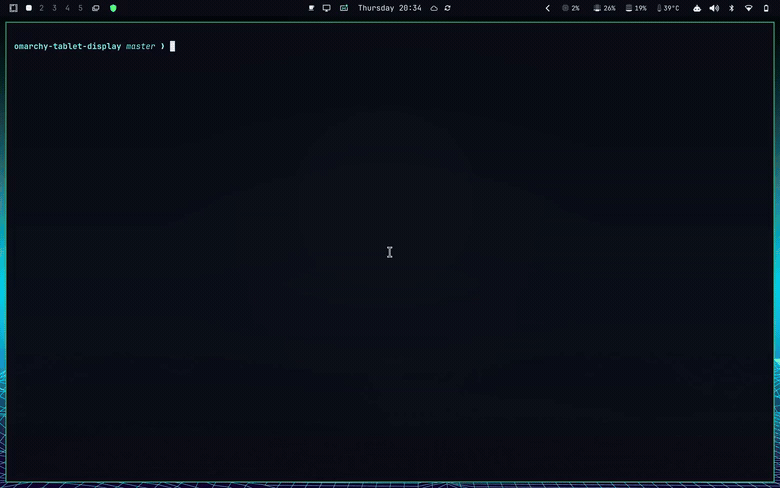
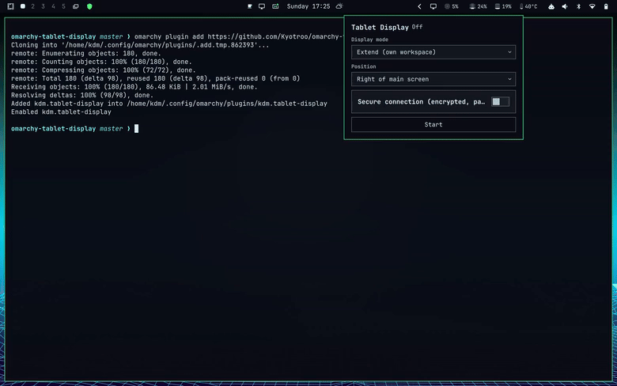
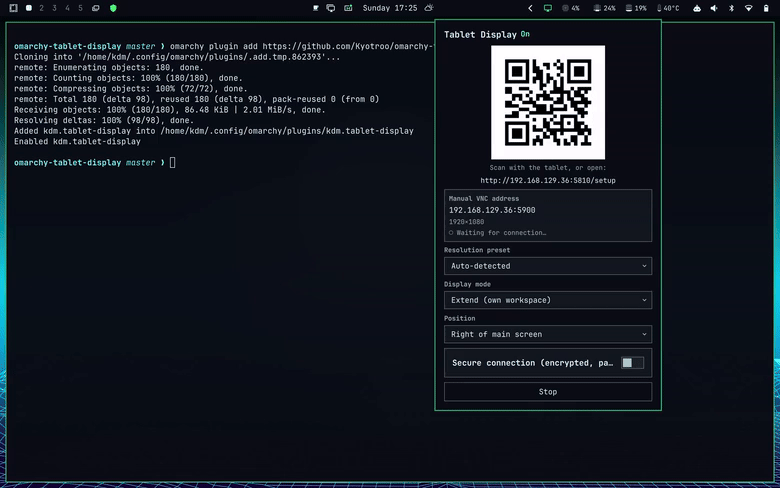

# Tablet Display

Turn a tablet — or any other device with a VNC client, including another PC —
into a wireless second monitor for Omarchy over your LAN. Click the bar
toggle, scan a QR code, connect. No manual Hyprland config, no running
`wayvnc` from a terminal.

## What it does

- **One bar icon**, click to open a panel showing a QR code and the raw
  connection address.
- **Auto-configuring resolution**: the tablet's browser reports its real
  screen size once, and the virtual display is resized to match — no
  guessing a resolution ahead of time.
- **Extend or Duplicate**: use the tablet as a genuine second monitor with
  its own workspace (Extend, the default), or mirror your current screen
  onto it (Duplicate).
- **Position**: tell Hyprland which side of your main screen the new
  display sits on (left/right/above/below), so window/workspace movement
  between screens goes the direction you'd expect.
- **Always encrypted**: every session is TLS + username/password
  protected (self-signed certificate, generated once) — there's no setting
  to turn it off, so there's no accidentally-unauthenticated LAN exposure.
- **Resolution presets**: a small bundled list of tablets to pick from
  instead of relying on auto-detection, for cases like split-screen mode or
  a forced OS zoom level throwing the auto-detected size off.

## Install

```bash
omarchy plugin add https://github.com/Kyotroo/omarchy-tablet-display.git --enable
```

This only adds the plugin files and shows the bar icon — it's a plain
`git clone` plus enabling the widget, nothing more. The background
service isn't installed or running yet; that's a separate one-time step
below.

## Quick start



1. Click the bar icon. The panel opens.
2. **First time only**: the panel shows a "Set up now" button instead of
   the usual controls. Click it. This is what actually installs
   [`wayvnc`](https://github.com/any1/wayvnc) via `pacman` if it isn't
   already on your system (it isn't part of a base Omarchy install, and
   the daemon does the actual screen-sharing through it), adds a scoped
   `ufw` allow rule for your LAN if `ufw` is present (see
   [Firewall](#firewall) if you use something else), and installs/starts
   the background service itself. Either of those first two can need a
   password — Omarchy's own polkit agent (the same GUI prompt you see
   elsewhere, e.g. when a sandboxed AI agent needs elevated access) pops
   up for it right there, since it authenticates over D-Bus rather than
   needing a terminal. If that agent isn't available for some reason, it
   falls back to printing the exact command to run yourself instead of
   failing silently.
3. Click **Start**.



4. Scan the QR code with the tablet (or open the printed address in its
   browser).
5. The page detects the tablet's screen, reports it back, and offers a
   button to open the address directly in a VNC app — installing one first
   if needed (defaults to [RealVNC
   Viewer](https://www.realvnc.com/en/connect/download/viewer/), available
   free on Android, iOS, Windows, macOS, and Linux). The VNC app asks for
   the username/password shown on the same page, and shows a one-time
   "untrusted certificate" prompt the first time — expected for a
   self-signed certificate, the same as any other self-managed device on
   your network; accept it.
6. Click the bar icon again (or the Stop button in the panel) to tear
   everything down cleanly.

Step 2 is one-time — after that, opening the panel goes straight to a
Start button instead of "Set up now".

## Using another PC to control this one

VNC's remote-input handling was never turned off for the tablet use case,
so this already works today with no extra setup: point a desktop VNC
client (RealVNC Viewer, or any RFB-compatible client) at the address shown
in the panel, using **Duplicate** mode so it's viewing/controlling your
actual desktop rather than a separate virtual one. Mouse and keyboard input
from that PC reaches this machine exactly like a local input device would.

This is standard VNC remote-desktop behavior, not something specific to
tablets — the tablet-oriented parts of this plugin (the QR code, the
mobile app store detection/links) are just a convenience layer on top of
the same underlying session.

**A real limitation to know about**: VNC (the RFB protocol) has no concept
of touch input — only a mouse pointer position and buttons. If the
*controlling* PC has a touchscreen, touching it will feel like an awkward
trackpad rather than real touch, because the OS is translating touch into
synthetic mouse events before the VNC client ever sees it. There's no
setting on this plugin's side that changes that — it's a property of the
protocol itself. Some mobile VNC apps offer a "touch vs. trackpad" mode in
their own settings; most desktop clients don't.

## Settings



All of these live in the panel and take effect immediately if a session is
already running (a brief VNC disconnect/reconnect while the change
applies, since wayvnc has no way to change these without restarting):

| Setting | Notes |
| --- | --- |
| Resolution preset | Overrides auto-detection; pick "Auto-detected" to go back to reading the tablet's own reported size. |
| Display mode | **Extend** (default): a real second monitor with its own workspace. **Duplicate**: mirrors whichever screen is currently focused — no separate workspace, since it isn't a separate display. |
| Position | Where the new display sits relative to your main screen. Only meaningful in Extend mode. |
| Username / Password | Always shown once a session has started. A random password is generated the first time, self-signed certificate generated once and reused; use Regenerate for a new random one, or type your own. |

## Firewall

The VNC session itself is always TLS + password protected, but the setup
page (the one the QR code opens) still only needs to be reachable, not
public — so it's scoped to your LAN by the firewall rule the installer adds
(`ufw`, if present) rather than by the plugin itself. The setup page's one
POST endpoint (which reports the tablet's screen size back) is further
bound to a per-session token embedded in that same QR/link, so a device
that never loaded it can't call it. If you use a different firewall, or
`ufw` wasn't active at install time, allow inbound TCP on the setup port
(5810 by default) and the VNC port (5900 by default) from your LAN subnet.

## Known limitations

- **LAN only.** No remote/off-network access (e.g. via Tailscale) in this
  version.
- **One tablet at a time.** Starting a new session while one is already
  running is a no-op, not a second simultaneous display.
- **No touch-to-input passthrough design.** The tablet is a display (and,
  incidentally, a full VNC client with mouse/keyboard-equivalent input from
  its VNC app) — not a Sidecar-style touch-aware input device. See the
  touch/trackpad note above.
- **DPMS / screen lock**: wayvnc sessions have been reported elsewhere to
  drop about 30 seconds after the physical screen locks. The daemon
  auto-respawns wayvnc if it exits unexpectedly, so a dropped session
  should reconnect on its own rather than needing a manual restart, but a
  locked screen briefly interrupting the session is a known rough edge, not
  fully eliminated.

## Uninstall

Omarchy's plugin system only does file operations on removal (disable,
delete/unlink) — it has no hook to run a plugin's own cleanup script
automatically, so that has to happen first, while the plugin directory
(and its scripts) still exist:

```bash
omarchy plugin disable kdm.tablet-display
bash ~/.config/omarchy/plugins/kdm.tablet-display/scripts/uninstall-daemon.sh
omarchy plugin remove kdm.tablet-display --yes
```

The middle step stops and removes the systemd unit, sockets, generated
certificate, and the `ufw` rule the installer added. Unlike some plugins,
there's no user-authored data to preserve on removal — presets.json is a
bundled asset, not something you edit.

## Development

```bash
bash tests/run.sh
```

Runs the full test suite: the daemon's state machine and IPC protocol
against fake `hyprctl`/`wayvnc`/`ip`/`openssl` fixtures, the embedded setup
HTTP server, the setup page's platform-detection logic (under a mocked
DOM, via Node), the firewall subnet-detection helper, and the wayvnc
dependency check (against fake `pacman`/`sudo` fixtures).

## License

[MIT](LICENSE) © kdm
